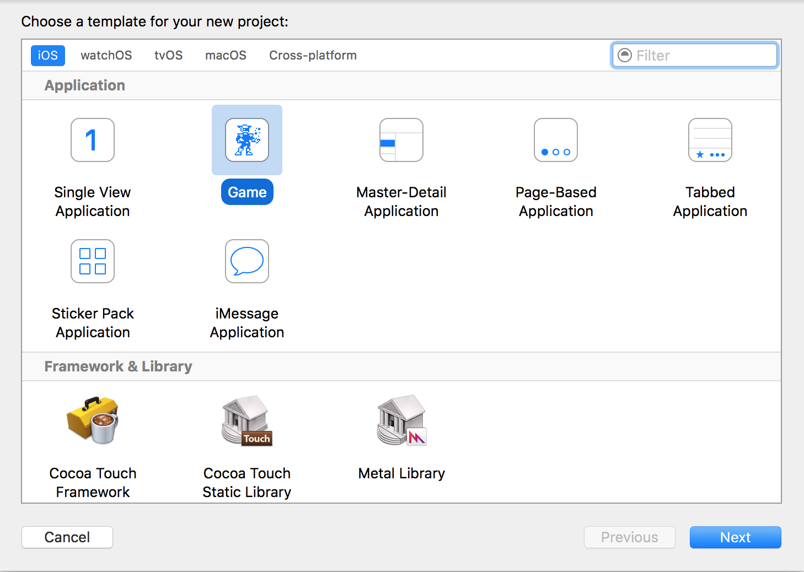
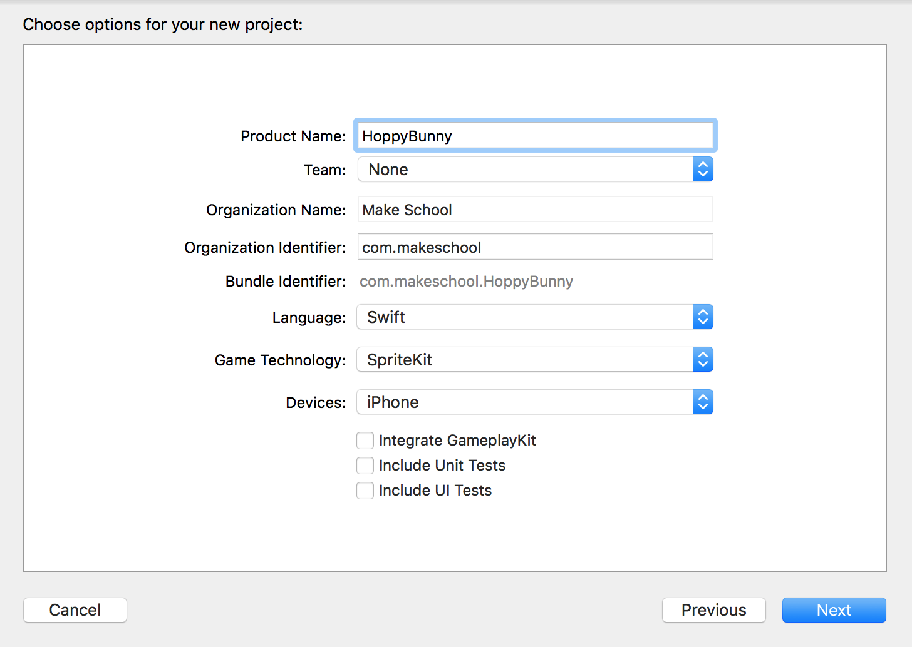

If you have never built a side scroller before, you may find the implementation a little strange. Normally, when considering about a game like Flappy Bird, you might be thinking that you want to generate a level, then have the character move through the level, with a camera following. However, this is not how it actually works!

What _actually_ happens is that the character stays stationary (at least horizontally), and the entire level moves towards the character, creating an illusion of the character moving through the level. It turns out that this is much easier to implement than the alternative.

In order to accomplish this, you will learn to implement:

- A physics controlled bunny
- Dynamic obstacle object generation and removal
- Animation and actions
- World scrolling
- Physics based collision detection
- Your own custom button class

#Create a new project

Time to get started and make a new SpriteKit project in Xcode and get started with Hoppy Bunny!

> [action]
> Your first step is to create a new SpriteKit Xcode project, open Xcode and select `Create a new Xcode project`. Then select `iOS > Application > Game` as shown below:
>
> 
>
1. Enter `HoppyBunny` for `Product Name`.
1. For `Organization Name` you can enter your name, a fake company name, or `Make School`
1. For `Organization Identifier`, use a reverse domain name style base for your apps. If you own `supercoolsecretstudios.com` you would put `com.supercoolsecretstudios`. If you don't own a domain name, feel free to put `com.makeschool` for this project.
1. Select `Swift` as the `Language`
1. Select `SpriteKit` (not `SceneKit`!) as the `Game Technology`
1. Select `iPhone` as the `Devices`
1. Leave `Include Unit Tests` and `Include UI Tests` unchecked
>
> 

##Adding artwork

> [action]
>
1. After the project is created, you should [Download the Art Pack](https://github.com/MakeSchool-Tutorials/Hoppy-Bunny-SpriteKit-Swift3/raw/master/assets.zip).
1. First unzip the downloaded *assets.zip* file
1. Select the `Assets.xcassets` folder in the Xcode project navigator
1. Delete the `Spaceship` asset by clicking on it and pressing `delete` on your keyboard
1. Drag the downloaded assets into Xcode
>
> 

##Adding Sound Effects

> [action]
> Download the [SFX Pack](https://github.com/MakeSchool-Tutorials/Hoppy-Bunny-SpriteKit-Swift3/raw/master/SFX.zip) we created for you. Once the download is complete, unzip the folder and add it to the project by dragging the entire unzipped folder into Xcode. **Make sure to check the *Copy items if needed* checkbox!**
>
> 

##Asset Scale

This would be good time to touch on the subject of asset scale. You may have noticed when you select an asset in **Assets.xcassets** you are presented with *1x 2x 3x Scale* options.  The assets you added have the `@2x` suffix so they are designed for 2x retina use. Thankfully, Spritekit is smart enough to scale any assets we give it for use in different devices, but overall it's best to provide assets in 1x, 2x and 3x sizes.

Have a look at this handy [Device resolution guide](http://www.paintcodeapp.com/news/ultimate-guide-to-iphone-resolutions) to see which phones use which asset sizes.

#Summary
Great, you've setup a basic project and added the artwork! In the next section it's time to start building our game.
